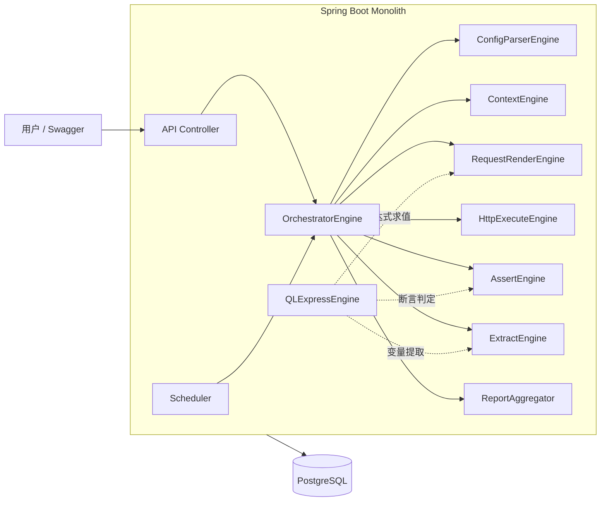
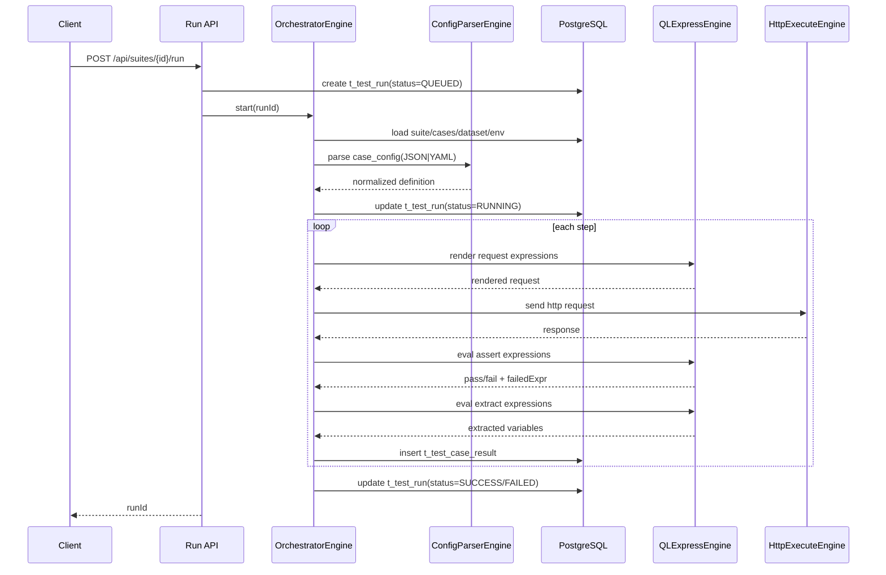
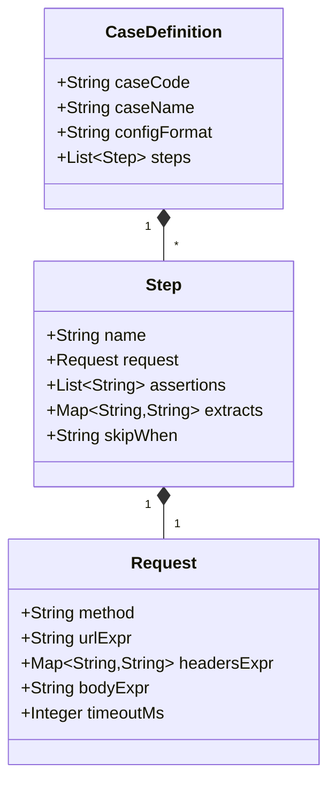
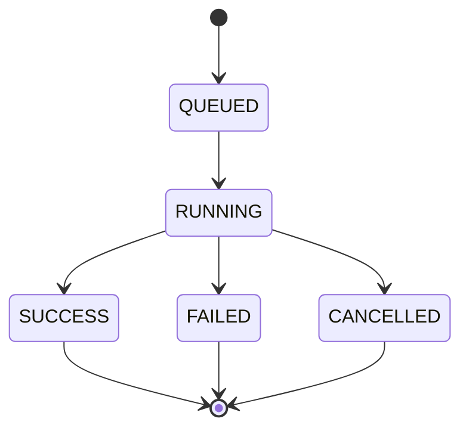

# 极简架构设计（Mermaid）- QLExpress 自定义引擎版

## 1. 设计前提

- 单体应用：Spring Boot
- 单数据库：PostgreSQL
- 无 Redis / MQ / 对象存储
- 规则与断言统一用 QLExpress
- 用例配置支持 YAML / JSON 双格式

---

## 2. 系统组件图

---

## 3. 执行时序图（手动触发）

---

## 4. 用例结构图（Case Config）

其中 `configFormat` 允许值为 `JSON` 或 `YAML`。

---

## 5. 运行状态机

---

## 6. 引擎边界说明

1. **ConfigParserEngine** 负责 YAML/JSON 解析与统一化，不参与 HTTP 执行。  
2. **QLExpressEngine** 只做表达式计算，不负责 HTTP 发送。  
3. **HttpExecuteEngine** 只做请求发送，不做断言。  
4. **Assert/Extract** 依赖 QLExpressEngine，保持规则统一。  
5. **OrchestratorEngine** 负责流程编排和落库，是唯一流程入口。  

---

## 7. 执行策略说明（固定）

1. step 失败：fail-fast，终止当前 case。  
2. case 失败：suite 继续执行。  
3. 访问模式：无登录，仅内网 + IP 白名单。  
