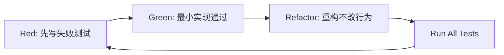

# TDD 开发指南（QLExpress 自定义引擎）

## 1. 目标

给单人仓库一个可执行的 TDD 操作标准，避免“先写实现再补测试”。

---

## 2. 开发循环

---

## 3. 测试层级与职责

## 3.1 单元测试（优先覆盖）

### 目标对象

- `ContextEngine`
- `ConfigParserEngine`
- `RequestRenderEngine`
- `AssertEngine`
- `ExtractEngine`

### 最小用例集合

1. 正常路径（表达式成立）
2. 失败路径（表达式不成立）
3. 边界路径（空输入/缺字段/类型不匹配）

## 3.2 组件测试（编排链路）

### 目标对象

- `OrchestratorEngine`

### 最小用例集合

1. 多 step 顺序执行
2. 中间 step 断言失败仍保留 run 结果
3. 提取变量可被后续 step 使用

## 3.3 API 测试

### 目标接口

- `POST /api/suites/{id}/run`
- `GET /api/runs/{id}`
- `GET /api/runs/{id}/report`

### 最小用例集合

1. 参数正确返回成功
2. 参数非法返回 4xx
3. 业务异常返回可追踪错误信息

---

## 4. 引擎级 TDD 清单

## 4.0 ConfigParserEngine

- [ ] 非法 JSON 配置返回明确错误
- [ ] 非法 YAML 配置返回明确错误
- [ ] 同一用例的 JSON/YAML 解析结果完全一致
- [ ] 解析后输出 `normalized_definition`

## 4.1 AssertEngine

- [ ] 表达式 `status == 200` 在 200 时返回 PASS
- [ ] 表达式 `status == 200` 在 500 时返回 FAIL
- [ ] FAIL 时返回 `failedAssertExpr`
- [ ] 非法表达式抛出可读错误

## 4.2 ExtractEngine

- [ ] 能提取 `token = body.data.token`
- [ ] 提取失败不覆盖已有上下文
- [ ] 提取结果写入 `extracted_vars`

## 4.3 RequestRenderEngine

- [ ] URL/header/body 表达式渲染成功
- [ ] 缺变量时报错可定位
- [ ] 空表达式按字面量透传

## 4.4 OrchestratorEngine

- [ ] 按 `exec_order` 执行
- [ ] 失败 step 写入 `t_test_case_result`
- [ ] 执行结束更新 `t_test_run` 状态
- [ ] step 失败后终止当前 case（fail-fast）
- [ ] case 失败后 suite 继续执行后续 case

---

## 5. 提交规范（单人版）

每个功能提交至少包含：

1. 失败测试提交（可与实现同提交，但要能看到测试新增）
2. 实现代码
3. 必要重构
4. 通过结果说明（本地测试命令）

建议提交粒度：

- `test: add failing tests for AssertEngine`
- `feat: implement AssertEngine to pass tests`
- `refactor: simplify expression context mapping`

---

## 6. 通过标准（TDD DoD）

- 测试先于实现存在（至少在提交中可追踪）。
- 新增逻辑覆盖成功/失败/边界三类测试。
- YAML/JSON 双格式必须有等价性测试。
- 所有测试通过后再进入下一个功能点。
- 未覆盖测试的功能点视为“未完成”。
